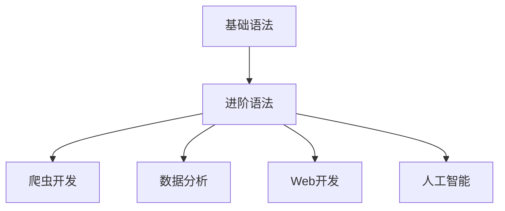

# Python学习导航

    
    <h2>从入门到精通的Python学习指南</h2>

## 📚 学习路径

Python学习可以分为三个主要阶段：基础语法、进阶语法和实践应用。推荐按照以下顺序进行学习：

## 📂 目录结构

| 学习阶段 | 学习内容 | 简介 |
|---------|---------|------|
| [基础语法](./基础语法/) | 环境配置、变量、数据类型、控制流、函数等 | Python的基本语法和编程概念，适合零基础入门 |
| [进阶语法](./进阶语法/) | 面向对象、文件操作、异常处理、多线程、协程等 | Python的高级特性和编程技巧，提升代码质量和效率 |
| [爬虫](./爬虫/) | 网络通信、HTTP协议、Requests库、反爬机制等 | 利用Python爬虫获取互联网数据的技术和实践 |

## 🔍 快速导航

### 基础语法
- [Python环境配置](./基础语法/环境配置.md)
- [基本语法与变量](./基础语法/基本语法与变量.md)
- [数据类型](./基础语法/数据类型.md)
- [控制流程](./基础语法/控制流程.md)
- [函数基础](./基础语法/函数基础.md)
- [模块与包](./基础语法/模块与包.md)

### 进阶语法
- [面向对象编程](./进阶语法/面向对象编程.md)
- [类与对象详解](./进阶语法/类与对象.md)
- [文件操作详解](./进阶语法/文件操作.md)
- [迭代器与生成器](./进阶语法/迭代器与生成器.md)
- [多线程编程](./进阶语法/多线程编程.md)
- [协程编程](./进阶语法/协程编程.md)

### 爬虫
- [爬虫概念与基础](./爬虫/爬虫概念.md)
- [网络通信原理](./爬虫/网络通信原理.md)
- [HTTP与HTTPS协议](./爬虫/HTTP协议.md)
- [请求与响应](./爬虫/请求与响应.md)
- [Requests库使用](./爬虫/Requests库.md)
- [Cookie与Session](./爬虫/Cookie与Session.md)
- [代理IP使用](./爬虫/代理IP.md)
- [Robots协议](./爬虫/爬虫概念.md#robots协议)

> 注：爬虫部分内容以初始笔记(./爬虫/初始笔记.md)为基础，对其进行了系统化的整理和扩展。

## 📝 学习建议

1. **循序渐进**：按照基础→进阶→应用的顺序学习，不要跳级
2. **多动手实践**：编程是实践性强的学科，理论结合实践才能真正掌握
3. **项目驱动**：设定小目标，通过完成项目来提升能力
4. **问题导向**：遇到问题主动查资料，解决问题的过程就是最好的学习
5. **持续学习**：技术在不断更新，保持学习的习惯

## 🔗 推荐资源

- **官方文档**：[Python官方文档](https://docs.python.org/zh-cn/3/)
- **在线教程**：[菜鸟教程](https://www.runoob.com/python3/python3-tutorial.html)、[廖雪峰Python教程](https://www.liaoxuefeng.com/wiki/1016959663602400)
- **在线实践**：[LeetCode](https://leetcode.cn/)、[Python-100-Days](https://github.com/jackfrued/Python-100-Days)
- **书籍推荐**：《Python编程：从入门到实践》、《流畅的Python》

## 📈 学习进度表

可以使用以下表格记录自己的学习进度：

| 学习内容 | 开始日期 | 完成日期 | 完成度 | 笔记链接 |
|---------|---------|---------|------|---------|
| 基础语法 |         |         |      |         |
| 进阶语法 |         |         |      |         |
| 爬虫基础 |         |         |      |         |

---

> 坚持学习，循序渐进，你会发现Python带给你的惊喜远不止于此！ 