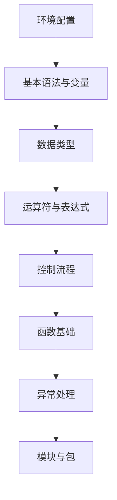

# Python基础语法学习导航

    
    <h2>Python编程基础</h2>

## 📚 目录

- [Python环境配置](./环境配置.md)
- [基本语法与变量](./基本语法与变量.md)
- [数据类型](./数据类型.md)
- [运算符与表达式](./运算符.md)
- [控制流程](./控制流程.md)
- [函数基础](./函数基础.md)
- [异常处理](./异常处理.md)
- [模块与包](./模块与包.md)

## 🔍 学习路径

## 📝 学习建议

- 理解Python的基础语法是深入学习的前提
- 多动手实践每个知识点
- 掌握基本数据类型和控制流程
- 理解函数的定义和使用
- 学会处理异常和导入模块

> 🔔 提示：Python是一门易学难精的语言，基础语法简单但应用灵活多样。 