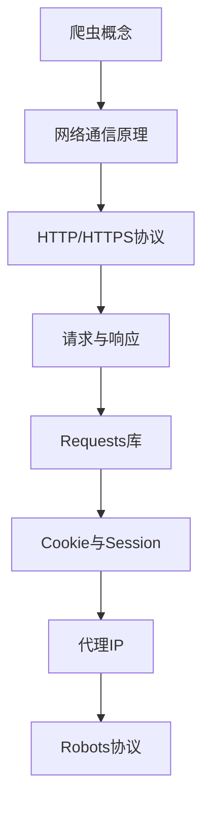

# Python爬虫学习导航

    
    <h2>网络爬虫基础与实践</h2>

## 📚 目录

- [爬虫概念与基础](./爬虫概念.md)
- [网络通信原理](./网络通信原理.md)
- [HTTP与HTTPS协议](./HTTP协议.md)
- [请求与响应](./请求与响应.md)
- [Requests库使用](./Requests库.md)
- [Cookie与Session](./Cookie与Session.md)
- [代理IP使用](./代理IP.md)
- [Robots协议](./爬虫概念.md#robots协议)

> 注：本文档内容以初始笔记(初始笔记.md)为基础，对其进行了系统化的整理和扩展。

## 🔍 学习路径

## 📝 学习建议

- 理解网络通信基本原理是学习爬虫的基础
- 掌握HTTP/HTTPS协议的请求和响应结构
- 熟练使用Requests库进行网络请求
- 学会处理反爬机制，如Cookie验证和IP限制
- 熟练掌握不同的解析方法提取所需数据
- 了解并遵守爬虫伦理和法律法规

> 🔔 注意：爬虫编写需遵守网站robots协议及相关法律法规，请合法合规使用爬虫技术。 