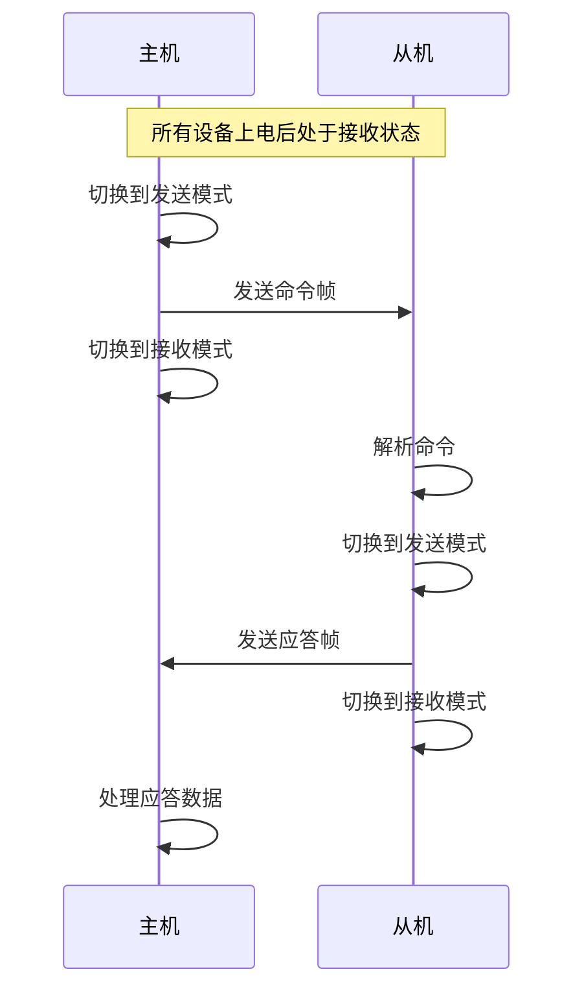

# Modbus协议详解

## Modbus通信架构

Modbus是一种基于主从（Master-Slave）架构的通信协议，广泛应用于工业自动化领域。在Modbus系统中，总是有一个主设备（主机）和一个或多个从设备（从机）。

<div style="text-align: center; margin: 20px 0; padding: 15px; border: 1px solid #ddd; background-color: #f9f9f9; border-radius: 5px;">
<strong>Modbus主从架构的关键特点</strong><br>
• 系统中有且仅有一个主机<br>
• 从机不能主动发送数据<br>
• 任何通信都必须由主机发起<br>
• 所有设备上电后默认处于接收状态
</div>

### 主从通信规则

<details>
<summary>主从通信的基本规则</summary>

在Modbus系统中，通信遵循以下规则：

1. **一个系统中只能有一个主机**
   - 主机负责发起所有通信
   - 主机控制总线访问权限

2. **从机不能主动发送数据**
   - 从机只能对主机的请求做出响应
   - 从机不能与其他从机直接通信

3. **主机询问，从机应答**
   - 主机发送命令帧
   - 从机接收并执行命令
   - 从机返回应答帧

4. **所有设备上电后默认处于接收状态**
   - 监听总线活动
   - 等待主机命令
</details>

## 通信流程

### 基本通信过程



### 半双工通信控制

在基于RS485的Modbus通信中，由于使用半双工方式，通信方向的控制非常重要：

1. **主机发送过程**：
   - 主机将485芯片切换到发送模式
   - 发送完成后立即切换到接收模式
   - 等待从机响应

2. **从机响应过程**：
   - 从机接收到命令后解析
   - 将485芯片切换到发送模式
   - 发送应答帧
   - 发送完成后立即切换回接收模式

<div style="text-align: center; color: red; font-weight: bold; margin: 15px 0;">
不正确的方向控制将导致通信失败！
</div>

## Modbus帧格式

Modbus协议支持两种传输模式：
- **RTU模式**：使用二进制编码，效率高，应用广泛
- **ASCII模式**：使用ASCII字符，可读性好，较少使用

### RTU模式帧格式

<details>
<summary>展开查看RTU帧格式详情</summary>

RTU模式下的帧格式如下：

| 字段     | 长度    | 说明                                      |
|---------|--------|------------------------------------------|
| 地址码   | 1字节   | 从机地址（1-247），0为广播地址              |
| 功能码   | 1字节   | 定义要执行的操作                           |
| 数据区   | N字节   | 请求/响应的数据内容，长度可变                |
| CRC校验  | 2字节   | 循环冗余校验，保证数据传输正确性             |

RTU模式特点：
- 使用二进制编码，传输效率高
- 字节间隔不超过1.5个字符时间
- 帧间隔超过3.5个字符时间视为新帧开始
</details>

### ASCII模式帧格式

ASCII模式下的帧格式如下：

| 字段     | 内容         | 说明                                   |
|---------|-------------|---------------------------------------|
| 帧起始   | ':'（冒号）   | ASCII码为3A                            |
| 地址码   | 2字符        | 从机地址（00-FF）                       |
| 功能码   | 2字符        | 操作码                                 |
| 数据区   | N字符        | 请求/响应数据，每个字节用两个ASCII字符表示  |
| LRC校验  | 2字符        | 纵向冗余校验                            |
| 帧结束   | CR，LF       | 回车（0D）和换行（0A）                   |

## 地址码说明

- 地址范围: 0-247
- 地址0: 广播地址，所有从机均执行但不回应
- 地址1-247: 具体从机地址，对应命令的从机需执行并回应

## 功能码

Modbus定义了多种标准功能码，下表列出常用的功能码：

| 功能码 | 功能描述           | 操作对象       |
|-------|------------------|---------------|
| 01    | 读线圈状态         | 位（离散量）    |
| 02    | 读输入状态         | 位（离散量）    |
| 03    | 读保持寄存器       | 字（16位寄存器）|
| 04    | 读输入寄存器       | 字（16位寄存器）|
| 05    | 写单个线圈         | 位（离散量）    |
| 06    | 写单个寄存器       | 字（16位寄存器）|
| 15    | 写多个线圈         | 位（离散量）    |
| 16    | 写多个寄存器       | 字（16位寄存器）|

<details>
<summary>最常用的三个功能码：03/06/16</summary>

### 03功能码（读保持寄存器）
- 用途：读取一个或多个寄存器的内容
- 应用场景：读取传感器数据、状态信息等

### 06功能码（写单个寄存器）
- 用途：写入单个寄存器的值
- 应用场景：设置参数、控制命令等

### 16功能码（写多个寄存器）
- 用途：同时写入多个寄存器的值
- 应用场景：批量参数设置、复杂控制等
</details>

## 数据包分割机制

Modbus RTU模式没有使用特定的起始符和结束符来标识数据包，而是采用时间间隔来进行断帧：

- **字符间间隔**：不超过1.5个字符时间（按当前波特率计算）
- **帧间间隔**：至少3.5个字符时间

例如，在9600波特率下：
- 1个字符传输时间 ≈ 1.04ms（10比特，包括起始位和停止位）
- 1.5个字符时间 ≈ 1.56ms
- 3.5个字符时间 ≈ 3.64ms

这种断帧方式需要在实际程序中使用定时器实现超时检测。

## CRC校验

Modbus RTU模式使用16位CRC校验（CRC-16），计算方法如下：

<details>
<summary>CRC-16计算流程</summary>

1. 预置一个16位寄存器为0xFFFF（全为1）
2. 将报文的第一个字节与16位寄存器的低8位进行异或运算
3. 将结果右移一位
4. 如果移出的位是1，则将寄存器与多项式0xA001进行异或运算
5. 如果移出的位是0，则不进行异或运算
6. 重复步骤3-5，直到完成8次移位操作
7. 取下一个字节与寄存器的值进行异或运算
8. 重复步骤3-7，直到处理完所有字节
9. 最终寄存器的值就是CRC码

注意：在Modbus协议中，CRC码的低字节在前，高字节在后。
</details>

```c
// CRC-16计算函数示例
unsigned short CRC16(unsigned char *puchMsg, unsigned short usDataLen) {
    unsigned char uchCRCHi = 0xFF;  // 高字节初值 
    unsigned char uchCRCLo = 0xFF;  // 低字节初值
    unsigned short uIndex;          // CRC表索引
    
    while (usDataLen--) {
        uIndex = uchCRCLo ^ *puchMsg++;
        uchCRCLo = uchCRCHi ^ auchCRCHi[uIndex];
        uchCRCHi = auchCRCLo[uIndex];
    }
    return (uchCRCHi << 8 | uchCRCLo);
}
```

## Modbus通信的异常处理

当从机无法执行主机命令时，会返回异常响应：

| 异常码 | 描述                   |
|-------|------------------------|
| 01    | 不支持的功能码          |
| 02    | 非法数据地址            |
| 03    | 非法数据值              |
| 04    | 从机设备故障            |
| 05    | 确认                   |
| 06    | 从机设备忙              |

异常响应帧格式：
- 从机地址（与请求相同）
- 功能码（请求功能码+0x80）
- 异常码（如上表）
- CRC校验

---

**需要插入图片的位置**：
1. Modbus系统架构图
2. Modbus RTU帧格式示意图
3. Modbus通信时序图
4. CRC校验算法流程图

---

## 总结

- Modbus是一种基于主从架构的通信协议
- 主机发起通信，从机响应，从机不能主动发送数据
- RTU模式使用二进制编码，效率高，应用广泛
- 常用功能码：03（读保持寄存器）、06（写单个寄存器）、16（写多个寄存器）
- 在RS485半双工通信中，正确控制收发方向是成功通信的关键 